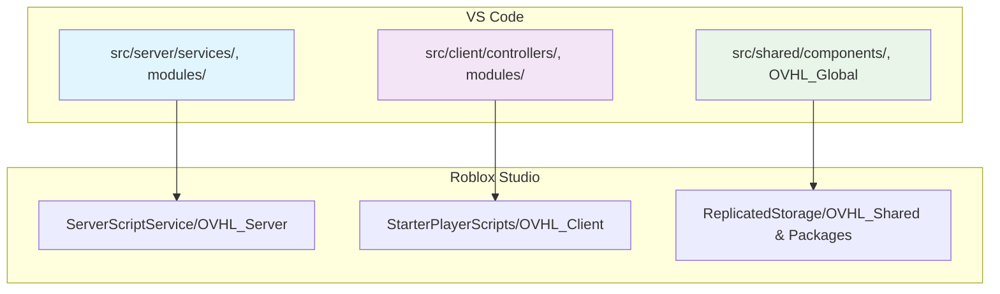

# 🧠 AI CHEAT SHEET - OVHL CORE v1 (Luau)

Dokumen ini adalah ringkasan **konsep inti**, **aturan kerja AI**, dan **panduan cepat konteks** untuk framework OVHL Core v1.
AI HARUS PROAKTIF minta dokumen detail (01--10) sebelum implementasi bila konteks belum lengkap.

**Versi:** 1.0.0 (29 Oktober 2025) - **Full Context Edition**

---

## 🎯 1. FILOSOFI UTAMA - **ENHANCED**

1. 🔥 **Auto-Discovery:** Semua entitas (`service`, `controller`, `module`, `component`, dan `config`) otomatis terdeteksi via `__manifest`. **Tidak ada registrasi manual.**
2. 🔑 **API Sederhana (`OVHL`):** Satu _global accessor_ untuk fungsi umum.
3. ⚖️ **Coder vs. Builder:** Pemisahan workflow berbasis atribut `ovhl:component`.
4. ⚠️ **"No Crash":** Semua _runtime logic_ **WAJIB** `pcall` + structured logging.
5. 🤖 **SDK/AI Ready:** Arsitektur eksplisit untuk tools & AI.
6. 🚀 **PROAKTIF VISIONER:** AI harus kasih saran improvement & future-proofing.

---

## 🗺️ 2. ARSITEKTUR DASAR - **COMPLETE**



**AI ACTION:** Selalu tanya struktur folder spesifik sebelum coding!

---

## 🔥 3. AUTO-DISCOVERY & LIFECYCLE - **ENHANCED**

```
-- STANDAR HEADER WAJIB (Dokumen 03)
--[[
    File: src/server/services/LoggerService.lua
    Tujuan: Core service untuk structured logging
    Versi Modul: 1.0.0
--]]

Module.__manifest = {
    name = "NamaModul",
    version = "1.0.0",
    type = "module", -- service, controller, module, component
    dependencies = {"Logger", "DataService"},
    coreDependency = ">=2.0.0"
}

-- LIFECYCLE WAJIB (Dokumen 03)
1. :Inject(services)
2. :Init()
3. :Start()

```

---

## 💉 4. DEPENDENCY INJECTION - **COMPLETE**

```
dependencies = {"Logger", "DataService", "EconomyService"}

function Module:Inject(services)
    self.logger = services.Logger
    self.dataService = services.DataService
end

function Module:Init()
    assert(self.logger, "Logger not injected!")
    assert(self.dataService, "DataService not injected!")
    return true
end

```

**AI ACTION:** Jangan inject manual, selalu deklarasi di manifest!

---

## ⚠️ 5. ERROR HANDLING - **ENHANCED**

```
function Module:RiskyOperation(player)
    local success, result = pcall(function()
        if not player then error("Invalid player") end
        return self.dataService:GetData(player)
    end)

    if not success then
        self.logger:Error("RiskyOperation failed", {
            player = player and player.Name,
            error = result
        })
        return false, "Operation failed"
    end
    return true, result
end

```

**RACE CONDITION PREVENTION**

- Client: Debounce UI

- Server: Atomic ops / locking

---

## 🔐 6. NETWORKING v1 - **COMPLETE**

```
return {
    ["Shop:BuyItem"] = t.tuple(t.string, t.integer),
    ["Player:UpdateStats"] = t.table
}

```

✅ Schema Validation
✅ Rate Limiting
✅ Batching
✅ Network Monitoring

---

## 🎨 7. UI FRAMEWORK - **ENHANCED**

```
local state = Value(0)
local derived = Computed(function() return state:get() * 2 end)

OVHL:SetState("playerHealth", 100)
local health = OVHL:GetState("playerHealth")

Cleanup(function()
    local conn = event:Connect(...)
    return function() conn:Disconnect() end
end)

```

---

## ⚙️ 8. KONFIGURASI - **NEW SECTION**

```
local coreConfig = OVHL:GetConfig("Core")
self.debugEnabled = coreConfig.DebugEnabled or false

Module.__config = {
    featureEnabled = true,
    maxPlayers = 10
}

```

---

## 📋 9. STANDAR KODING - **NEW SECTION**

- `MAJOR.MINOR.PATCH` (SemVer)

- Header wajib:

```
--[[
    File: path/relatif/NamaFile.lua
    Tujuan: Deskripsi singkat
    Versi Modul: X.Y.Z
--]]

```

---

## 🚀 10. AI WORKFLOW - **NEW SECTION**

1.  **ANALISIS:** Minta dokumen terkait (01--10)

2.  **IDENTIFY GAPS:** Kasih saran improvement

3.  **FUTURE-PROOF:** Implement scalable

4.  **BENCHMARK:** Bandingkan best practices

5.  **DOCUMENT:** Update log sesi

**Contoh Prompt:**

> "Bro, boleh liat `01_ARCHITECTURE_CORE.md` dan `06_NETWORKING_SECURITY.md` sebelum gua bikin LoggerService?"

---

## 🔑 11. API UTAMA - **ENHANCED**

```
-- SERVER
OVHL:GetConfig(moduleName)
OVHL:Emit(eventName, ...)
OVHL:Subscribe(eventName, callback)

-- CLIENT
OVHL:SetState(key, value)
OVHL:GetState(key)
OVHL:Subscribe(key, callback)
OVHL:Fire(remoteName, ...)
OVHL:Invoke(remoteName, ...)
OVHL:Listen(remoteName, callback)

```

---

## 🎯 **AI MANDATE BARU:**

**DARI SEKARANG, AI HARUS:**

- ✅ **PROAKTIF** minta dokumen detail

- ✅ **VISIONER** kasih saran improvement

- ✅ **KRITIS** identifikasi gaps

- ✅ **STANDARDIZED** ikuti dokumen 03

- ✅ **COLLABORATIVE** update log dengan insight

---

## 🧭 QUICK CONTEXT GUIDE (untuk AI)

> 🎯 Tujuan: Biar AI tahu kapan harus **minta file tambahan** supaya konteks lengkap sebelum generate kode atau analisis.

AI HARUS PROAKTIF. Kalau file di bawah ini **belum di-upload**, AI wajib **meminta file tersebut secara eksplisit** sebelum lanjut kerja.

| 🧩 Jenis Task / Konteks                    | 📘 File Blueprint yang Dibutuhkan               | 💬 Kapan Diperlukan                           |
| ------------------------------------------ | ----------------------------------------------- | --------------------------------------------- |
| 🏗️ **Core / Bootstrap / Lifecycle**        | `01_ARCHITECTURE_CORE.md`                       | Untuk task arsitektur, init, auto-discovery   |
| Workflow AI dan DEV                        | `02_DEV_WORKFLOW.md`                            | baca jika perlu penjelasan workflow           |
| 💉 **Dependency Injection / Coding Style** | `03_CODING_STANDARDS_DI.md`                     | Untuk implementasi service/module DI          |
| 🎨 **UI / Fusion Hooks / Components**      | `04_UI_FRAMEWORK_HOOKS.md`                      | Untuk controller UI, state management, visual |
| 🔐 **Networking / Security / Remotes**     | `06_NETWORKING_SECURITY.md`                     | Untuk remotes, schema, network layer          |
| ⚙️ **SDK / CLI / AI Tools**                | `09_SDK_ECOSYSTEM.md`                           | Untuk SDK CLI, auto-generator, AI tools       |
| 🧠 **Troubleshooting / Debugging**         | `10_TROUBLESHOOTING_FAQ.md`                     | Saat error runtime di fase dev/testing        |
| 🔎 **Documentation / Recipes / API Ref**   | `07_API_REFERENCE.md`, `08_COOKBOOK_RECIPES.md` | Untuk contoh kode & referensi API             |

---

## 🧪 TESTING & DEBUGGING PATTERNS

### Manual Testing Approach

- Jika AI menyarankan untuk membuat test manual script di studio, ai dapat generate di vs code dan menaruh didalam folder tests yang sudah disediakan.

```lua
-- Quick Debugging via Command Bar
local OVHL = _G.OVHL

-- 1. List all loaded services
print("📋 Loaded Services:")
for name, service in pairs(OVHL:getAllServices()) do
    print("   ✅ " .. name)
end

-- 2. Test specific service
local config = OVHL:getService("ConfigService")
print("🌍 Environment:", config:getEnvironment())

-- 3. Quick logger test
local logger = OVHL:getService("LoggerService")
logger:Info("ManualTest", "Testing from command bar!")
```

### Test Folder Structure (Organization Only)

```bash
./ <-- root
├──
src/
├── server/           → Framework
├── client/           → Framework
└── shared/           → Framework
test/
├── server/           → NamaScript.server.lua
├── client/           → NamaScript.clilent.lua
└── shared/           → NamaScript.modul.lua atau client.lua atau server.lua

```

> \*\*WARNING UNTUK AI : SAAT MEMBUAT CODE TEST PERHATIKAN `.server.lua` `.client.lua` `.modul.lua` AGAR TER ENCODE DENGAN BAIK OLEH ROJO

---

### Rojo Mapping Saat ini dan WORK :

```json
{
  "name": "ovhl-core",
  "tree": {
    "$className": "DataModel",
    "ReplicatedStorage": {
      "$className": "ReplicatedStorage",
      "OVHL_Shared": {
        "$path": "src/shared"
      },
      "OVHL_test_Shared": {
        "$path": "test/shared"
      }
    },
    "ServerScriptService": {
      "$className": "ServerScriptService",
      "OVHL_Server": {
        "$path": "src/server"
      },
      "OVHL_test_Server": {
        "$path": "test/server"
      }
    },
    "StarterPlayer": {
      "$className": "StarterPlayer",
      "StarterPlayerScripts": {
        "$className": "StarterPlayerScripts",
        "OVHL_Client": {
          "$path": "src/client"
        },
        "OVHL_test_Client": {
          "$path": "test/client"
        }
      }
    }
  }
}
```

---

### ✅ AI BEHAVIOR RULES

1.  Kalau task baru belum punya konteks penuh → **tanya file-nya dulu**

2.  Kalau task udah punya semua dokumen kunci → lanjut implementasi.

3.  Kalau dev upload file tambahan → AI update konteks internal otomatis.

4.  Kalau ada gap sistemik → tulis insight di `AI_DEV_LOG.md`.

---
