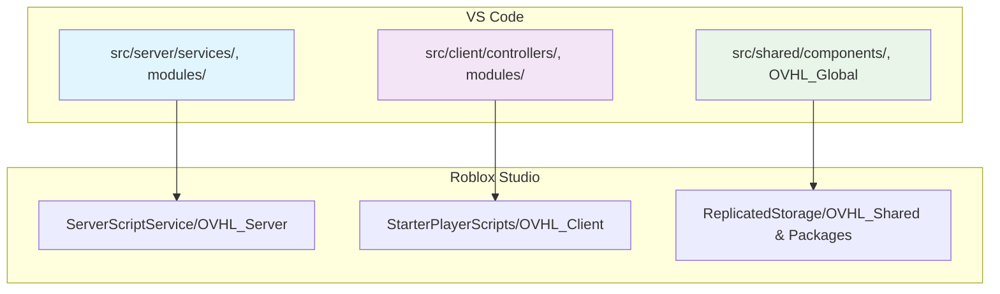

# 🧠 AI CHEAT SHEET - OVHL CORE v1 (Luau) - **REVISED**

Dokumen ini adalah ringkasan **konsep inti** dan **API utama** dari framework OVHL Core v1. **AI HARUS PROAKTIF** minta dokumen detail (01-10) sebelum implementasi.

**Versi:** 2.0.0 (29 Oktober 2025) - **UPGRADE BESAR!**

---

## 🎯 1. FILOSOFI UTAMA - **ENHANCED**

1.  🔥 **Auto-Discovery:** Modul otomatis terdeteksi via `__manifest`. **Tidak ada registrasi manual.**
2.  🔑 **API Sederhana (`OVHL`):** Satu _global accessor_ untuk fungsi umum.
3.  ⚖️ **Coder vs. Builder:** Pemisahan workflow berbasis atribut `ovhl:component`.
4.  ⚠️ **"No Crash":** Semua _runtime logic_ **WAJIB** `pcall` + structured logging.
5.  🤖 **SDK/AI Ready:** Arsitektur eksplisit untuk tools & AI.
6.  🚀 **PROAKTIF VISIONER:** AI harus kasih saran improvement & future-proofing.

---

## 🗺️ 2. ARSITEKTUR DASAR - **COMPLETE**



**AI ACTION:** Selalu tanya struktur folder spesifik sebelum coding!

---

## 🔥 3. AUTO-DISCOVERY & LIFECYCLE - **ENHANCED**

```lua
-- STANDAR HEADER WAJIB (Dokumen 03)
--[[
    File: src/server/services/LoggerService.lua
    Tujuan: Core service untuk structured logging
    Versi Modul: 1.0.0
--]]

Module.__manifest = {
    name = "NamaModul",       -- Wajib sama dengan nama file
    version = "1.0.0",        -- WAJIB SemVer (Dokumen 03)
    type = "module",          -- service, controller, module, component
    dependencies = {"Logger", "DataService"}, -- Deklarasi DI
    coreDependency = ">=2.0.0" -- Versi core minimal (Dokumen 03)
}

-- LIFECYCLE WAJIB (Dokumen 03)
1. :Inject(services)    -- Simpan dependensi ke self
2. :Init()             -- Setup internal, return true/false
3. :Start()            -- Logika aktif (subscribe event, dll)
```

---

## 💉 4. DEPENDENCY INJECTION - **COMPLETE**

**POLA DI v1 YANG BENER:**

```lua
-- 1. DEKLARASI di manifest
dependencies = {"Logger", "DataService", "EconomyService"}

-- 2. INJEKSI (framework otomatis panggil)
function Module:Inject(services)
    self.logger = services.Logger
    self.dataService = services.DataService
    -- Simpan semua dependensi ke self
end

-- 3. VALIDASI di Init (Best Practice)
function Module:Init()
    assert(self.logger, "Logger not injected!")
    assert(self.dataService, "DataService not injected!")
    return true
end
```

**AI ACTION:** Jangan inject manual, selalu deklarasi di manifest!

---

## ⚠️ 5. ERROR HANDLING - **ENHANCED**

**RUNTIME "NO CRASH" PATTERN:**

```lua
-- ✅ BENAR: Hanya bungkus bagian berisiko
function Module:RiskyOperation(player)
    local success, result = pcall(function()
        -- Operasi berisiko di sini
        if not player then error("Invalid player") end
        return self.dataService:GetData(player)
    end)

    if not success then
        self.logger:Error("RiskyOperation failed", {
            player = player and player.Name,
            error = result
        })
        return false, "Operation failed"
    end
    return true, result
end
```

**RACE CONDITION PREVENTION** (Dokumen 03):

- Client: Debounce UI dengan state management
- Server: Atomic operations / locking mechanism

---

## 🔐 6. NETWORKING v1 - **COMPLETE**

**KEAMANAN & VALIDASI:**

```lua
-- NetworkSchema.lua (WAJIB)
return {
    ["Shop:BuyItem"] = t.tuple(t.string, t.integer), -- Validasi parameter
    ["Player:UpdateStats"] = t.table -- Schema validation
}

-- Otomatis dapat:
-- ✅ Schema Validation via `t` library
-- ✅ Rate Limiting otomatis
-- ✅ Batching untuk OVHL:Fire
-- ✅ Network Monitoring (OVHL-022)
```

---

## 🎨 7. UI FRAMEWORK - **ENHANCED**

**FUSION HOOKS + OVHL INTEGRATION:**

```lua
local state = Value(0)
local derived = Computed(function() return state:get() * 2 end)

-- Global State Management
OVHL:SetState("playerHealth", 100)
local health = OVHL:GetState("playerHealth")

-- Cleanup wajib untuk prevent memory leaks
Cleanup(function()
    local conn = event:Connect(...)
    return function() conn:Disconnect() end
end)
```

---

## ⚙️ 8. KONFIGURASI - **NEW SECTION**

**GLOBAL vs LOKAL CONFIG** (Dokumen 03):

```lua
-- Flag debug global (WAJIB)
local coreConfig = OVHL:GetConfig("Core")
self.debugEnabled = coreConfig.DebugEnabled or false

-- Config lokal modul
Module.__config = {
    featureEnabled = true,
    maxPlayers = 10
}
local config = OVHL:GetConfig("ModuleName")
```

---

## 📋 9. STANDAR KODING - **NEW SECTION**

**VERSIONING WAJIB:**

- `MAJOR.MINOR.PATCH` (Semantic Versioning)
- Breaking changes → MAJOR++
- New features → MINOR++
- Bug fixes → PATCH++

**FILE HEADER WAJIB** (Dokumen 03):

```lua
--[[
    File: path/relatif/dari/src/NamaFile.lua
    Tujuan: Deskripsi singkat fungsi file
    Versi Modul: X.Y.Z (atau N/A)
--]]
```

---

## 🚀 10. AI WORKFLOW - **NEW SECTION**

**PROAKTIF VISIONER WORKFLOW:**

1. **ANALISIS:** Minta dokumen terkait (01-10) sebelum coding
2. **IDENTIFY GAPS:** Kasih saran improvement ke blueprint
3. **FUTURE-PROOF:** Implement dengan scalability in mind
4. **BENCHMARK:** Bandingkan dengan industry best practices
5. **DOCUMENT:** Update log dengan insight & learning

**CONTOH AI PROMPT:**
"Bro, sebelum implement LoggerService, boleh liat:

- `01_ARCHITECTURE_CORE.md` untuk sistem context
- `06_NETWORKING_SECURITY.md` untuk network logging
- `07_API_REFERENCE.md` untuk API spec

**Plus saran gue:** LoggerService perlu:

- Log rotation strategy
- Structured JSON format untuk parsing
- Async logging untuk performance"

---

## 🔑 11. API UTAMA - **ENHANCED**

```lua
-- SERVER
OVHL:GetConfig(moduleName)    -- Ambil config (global/lokal)
OVHL:Emit(eventName, ...)     -- Internal event bus
OVHL:Subscribe(eventName, callback) -- Event listener

-- CLIENT
OVHL:SetState(key, value)     -- Global UI state
OVHL:GetState(key, default?)  -- Baca state
OVHL:Subscribe(key, callback) -- State change listener
OVHL:Fire(remoteName, ...)    -- Fire & forget (batching)
OVHL:Invoke(remoteName, ...)  -- Request-response
OVHL:Listen(remoteName, callback) -- Server events
```

---

## 🎯 **AI MANDATE BARU:**

**DARI SEKARANG, AI HARUS:**

- ✅ **PROAKTIF** minta dokumen detail sebelum implementasi
- ✅ **VISIONER** kasih saran improvement & future-proofing
- ✅ **KRITIS** identifikasi gaps dalam blueprint
- ✅ **STANDARDIZED** ikuti best practices dokumen 03
- ✅ **COLLABORATIVE** update log dengan learning & insight

**INGAT:** Blueprint adalah living document - AI berperan aktif menyempurnakannya!
