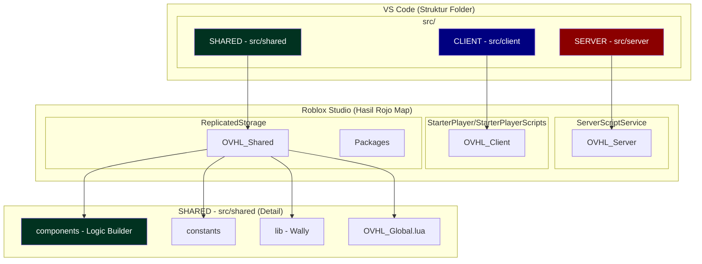
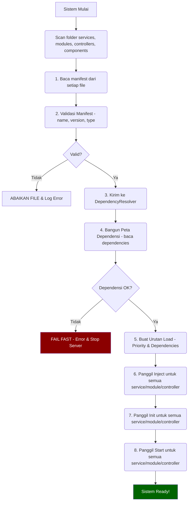
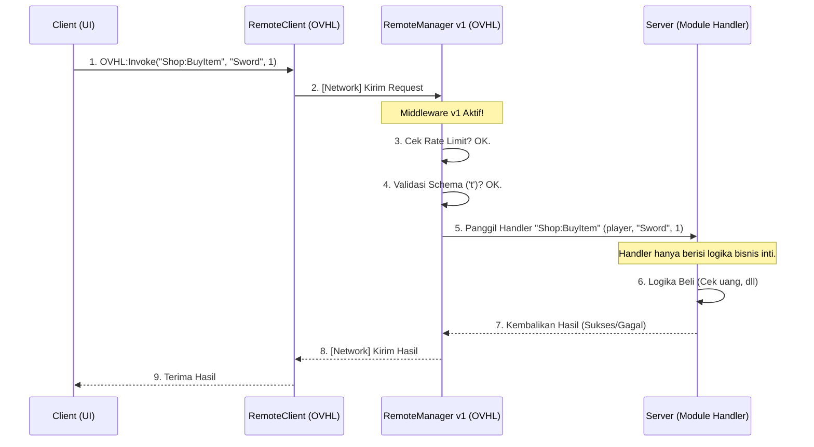

# 🏛️ 01 - ARSITEKTUR INTI (OVHL v1)

### 📋 INFORMASI DOKUMEN

| Properti           | Nilai                                         |
| ------------------ | --------------------------------------------- |
| **ID Dokumen**     | `ARC-v1-001`                                  |
| **Status**         | `Aktif (Rilis Baru)`                          |
| **Lokasi Path**    | `./docs/blueprint/01_ARCHITECTURE_CORE.md`    |
| **Tipe Dokumen**   | `Detail Arsitektur & Filosofi`                |
| **Target Audiens** | `Core Dev, Module Dev, Builder, AI Assistant` |
| **Relasi**         | `Index: 00_MASTER_BLUEPRINT_v1.md`            |
| **Penulis**        | `OVHL Core Team (Direvisi oleh Gemini)`       |
| **Dibuat**         | `29 Oktober 2025`                             |

---

## 🎯 1.1. FILOSOFI & VISI INTI (v1)

Arsitektur OVHL (v1) dirancang sebagai **ekosistem pengembangan game Roblox** yang **modular**, **scalable**, dan **sangat mudah digunakan**.

Tujuannya adalah menggabungkan arsitektur _Service-Oriented (SOA)_ dan _Component-Based_ yang 100% _native_ di atas Luau, sambil mempersiapkan fondasi untuk _tooling_ (SDK) dan kolaborasi AI di masa depan.

Visi ini berdiri di atas 5 pilar utama:

1.  🔥 **Auto-Discovery ("Tinggal Taruh, Langsung Jalan")**
    Menghilangkan _boilerplate_ (kode registrasi manual). Cukup buat file modul di folder yang benar dengan `__manifest`, framework akan otomatis mendeteksi, memvalidasi, dan me-loadingnya.

2.  🔑 **API Sederhana (`OVHL` Global Accessor)**
    Menyediakan satu "pintu masuk" (`OVHL`) yang simpel dan konsisten untuk semua kebutuhan umum developer, seperti mengambil _service_, mengatur _state_, atau mengirim _event_.

3.  ⚖️ **Pemisahan Coder vs. Builder (Visi v1)**
    Memberi alur kerja yang jelas. **Builder** fokus menata _Instance_ (Part, UI) di Studio dan memberi "Tag" (Atribut). **Coder** fokus membuat "Logic" (Komponen) di VS Code yang otomatis tersambung ke "Tag" tersebut.

4.  ⚠️ **Filosofi "No Crash" (Graceful Degradation)**
    Game **TIDAK BOLEH CRASH** hanya karena satu modul fitur gagal di-load atau error saat runtime. Sistem inti harus tetap stabil, mencatat error, dan melanjutkan eksekusi.

5.  🤖 **SDK-Ready & AI-Ready**
    Arsitektur dan dokumentasi dirancang secara eksplisit dan terstruktur (via `__manifest`, `Inject`, dll) agar _developer tools_ (SDK) dan AI Assistant dapat dengan mudah memahami, menganalisa, dan meng-generasi kode baru untuk proyek ini.

---

## 🗺️ 1.2. DIAGRAM ARSITEKTUR (HIGH-LEVEL)

Diagram ini menunjukkan struktur folder `src/` dan bagaimana Rojo memetakannya ke dalam Roblox Studio. Ini adalah pemisahan tiga lapisan utama kita: Server, Client, dan Shared.



- **`src/server`**: Hanya berjalan di Server. Berisi _core services_ (Logger, EventBus, ConfigService, DataService, RemoteManager, ModuleLoader, ComponentService, NetworkMonitorService, dll) dan _game modules_ (ShopModule, QuestSystem, AdminPanel, dll).
- **`src/client`**: Hanya berjalan di Client. Berisi _core controllers_ (StateManager, RemoteClient, UIEngine, UIController, ThemeController) dan _UI modules_ (HUD, InventoryScreen, LoginUI, dll).
- **`src/shared`**: Bisa diakses oleh Server dan Client.
  - `OVHL_Global.lua`: API `OVHL` utama kita.
  - `components`: **[v1 BARU]** Folder untuk logic Coder/Builder (Tag-based). Contoh: `LavaPart.lua`, `SpinningCoin.lua`.
  - `lib`: Library eksternal dari Wally (Fusion, 't', Promise, dll). JANGAN DIEDIT MANUAL.
  - `constants`: Konstanta game (XP_TABLE, ITEM_LIST, GAME_SETTINGS).
  - `utils`: Fungsi helper umum (ValidationUtils, MathUtils, StringUtils).
  - `NetworkSchema.lua`: **[v1 BARU]** Kontrak validasi untuk `RemoteManager`.

---

## 🔥 1.3. SISTEM AUTO-DISCOVERY (JANTUNG FRAMEWORK)

Ini adalah fitur inti OVHL. Framework secara **otomatis** mendeteksi, memvalidasi, mengurutkan, dan me-load semua _Services_, _Controllers_, _Modules_, dan _Components_ saat startup.

### 1.3.1. Alur Kerja Auto-Discovery

Sistem ini berjalan saat `init.server.lua` dan `init.client.lua` dieksekusi.



### 1.3.2. Struktur Wajib: `__manifest` (KTP Modul)

Setiap file _ModuleScript_ yang ingin ditemukan **WAJIB** memiliki tabel `__manifest`.

| Key              | Tipe      | Wajib? | Deskripsi                                                                                                                                       |
| :--------------- | :-------- | :----- | :---------------------------------------------------------------------------------------------------------------------------------------------- |
| `name`           | `string`  | **Ya** | Nama unik (Harus sama persis dengan nama file). Digunakan sebagai ID.                                                                           |
| `version`        | `string`  | **Ya** | Versi SemVer (misal: "1.0.0"). Untuk tracking & dependensi.                                                                                     |
| `type`           | `string`  | **Ya** | Tipe modul: `service` (Server Core), `controller` (Client Core), `module` (Fitur Game Server/Client), `component` (Shared Logic Coder/Builder). |
| `dependencies`   | `table`   | Tidak  | Daftar `name` (string) dari modul lain yang dibutuhkan sebelum modul ini di-load. **Kunci untuk Dependency Injection v1**.                      |
| `priority`       | `number`  | Tidak  | Urutan load relatif (0-100). 100 dieksekusi duluan di antara modul dengan dependensi yang sama. Default: 50.                                    |
| `domain`         | `string`  | Tidak  | Kategori/Domain modul (misal: `ui`, `gameplay`, `data`, `network`, `system`). Untuk organisasi & filtering.                                     |
| `description`    | `string`  | Tidak  | Penjelasan singkat fungsi modul (untuk developer & AI).                                                                                         |
| `coreDependency` | `string`  | Tidak  | Versi minimal OVHL Core yang dibutuhkan (misal: ">=2.1.0"). Belum diimplementasikan penuh.                                                      |
| `autoload`       | `boolean` | Tidak  | Apakah modul ini harus di-load otomatis saat startup? (Default: `true`).                                                                        |

**Contoh Kode:**

```lua
-- File: src/server/modules/ShopModule.lua
local ShopModule = {}
ShopModule.__index = ShopModule

-- MANIFEST (WAJIB)
ShopModule.__manifest = {
    name = "ShopModule",
    version = "1.0.0",
    type = "module", -- Ini adalah fitur gameplay server
    dependencies = {"Logger", "EconomyService", "DataService", "RemoteManager"}, -- Butuh service ini
    priority = 60, -- Load setelah EconomyService (misal prio 70)
    domain = "gameplay",
    description = "Mengelola logika toko item dalam game."
}

-- ... (sisa kode :Inject, :Init, :Start) ...

return ShopModule
```

### 1.3.3. Konfigurasi Default: `__config` (Opsional, STRONGLY RECOMMENDED)

Setiap modul (`service`, `controller`, `module`) **BOLEH** memiliki tabel `__config` untuk menyimpan pengaturan default (No-Hardcode).

- `ConfigService` (Core Service) akan membaca `__config` ini saat startup.
- Jika ada _live config_ (misal, dari Admin Panel) di `DataService` untuk modul ini, maka _live config_ itu yang akan dipakai (`OVHL:GetConfig` akan mengembalikan ini).
- Jika tidak ada _live config_, `__config` ini akan dipakai sebagai _default_, dan `ConfigService` mungkin akan menyimpannya ke `DataService` sebagai _live config_ awal.

**Contoh Kode:**

```lua
-- File: src/server/modules/ShopModule.lua
local ShopModule = {}
ShopModule.__manifest = { ... } -- Manifest ada di atas

-- KONFIGURASI DEFAULT (OPSIONAL)
ShopModule.__config = {
    IsEnabled = true, -- Fitur toko aktif?
    CanPurchaseMultiple = true,
    DefaultPrices = {
        Sword = 100,
        Shield = 150
    },
    RestockIntervalSeconds = 3600 -- Interval restock (1 jam)
}

-- Di dalam :Inject atau :Init
function ShopModule:Init()
    -- Ambil config (bisa jadi default atau live config dari Admin Panel)
    self.config = OVHL:GetConfig("ShopModule")

    if not self.config.IsEnabled then
        self.logger:Warn("ShopModule dinonaktifkan via config.")
        return false -- Batalkan loading modul ini
    end
end

return ShopModule
```

---

## 📡 1.4. POLA KOMUNIKASI (KRITIS!)

Arsitektur OVHL memiliki **DUA** saluran komunikasi yang berbeda dan terisolasi. Mencampurnya adalah risiko keamanan.

### 1.4.1. Internal (Server-Only): `EventBus`

Sistem _Pub/Sub_ (Publish/Subscribe) **aman** yang berjalan **HANYA DI SERVER**. Client tidak bisa mengaksesnya sama sekali.

- **Tujuan:** Komunikasi yang _decoupled_ (terpisah dan tidak saling bergantung langsung) antar _service_ dan _module_ di server. Memungkinkan modul bereaksi terhadap kejadian di modul lain tanpa perlu mengenalnya secara langsung.
- **Contoh:** `CombatModule` nge-`Emit("EnemyKilled", enemyData)`. `QuestModule`, `AchievementModule`, dan `LeaderboardService` mungkin nge-`Subscribe` ke _event_ itu untuk melakukan tugasnya masing-masing.
- **Akses:**
  - `OVHL:Emit(eventName: string, ...)`: Mengirim/Menerbitkan _event_.
  - `OVHL:Subscribe(eventName: string, callback: function)`: Mendaftar untuk mendengarkan _event_. Mengembalikan fungsi `unsubscribe`.
- **Keamanan:** Terjamin karena hanya bisa diakses dari _script_ Server.

```mermaid
graph LR
    subgraph "SERVER (Aman)"
        M1[Modul A - Combat] -- 1. Emit EnemyKilled --> EB[EventBus (via OVHL)];
        EB -- 2. Notify --> M2[Modul B - Quest];
        EB -- 2. Notify --> M3[Modul C - Achievement];
        EB -- 2. Notify --> S1[Service D - Leaderboard];
        M2 -.-> M1(Tidak Saling Kenal);
        M3 -.-> M1(Tidak Saling Kenal);
    end

    subgraph "CLIENT (Publik / Tidak Aman)"
        C[Player Client]
    end

    C -- X --> EB(AKSES DITOLAK);
```

### 1.4.2. Eksternal (Client <-> Server): `RemoteManager` v1

Ini adalah **SATU-SATUNYA GERBANG** komunikasi antara Client dan Server. Semua permintaan dari Client **HARUS DIANGGAP TIDAK AMAN** dan **WAJIB DIVALIDASI** oleh `RemoteManager` v1 sebelum diteruskan ke _handler_ di server.

- **Tujuan:** Menyediakan cara **aman** bagi Client untuk "minta" data/aksi dari Server (`Invoke`) atau "melaporkan" kejadian ke Server (`Fire`). Juga cara bagi Server untuk mengirim _event_ ke Client (`FireClient`, `FireAllClients`).
- **Contoh:** `ShopUI` (Client) `OVHL:Invoke("Shop:BuyItem", "Sword", 1)`. `RemoteManager` v1 (Server) menerima, **memvalidasi tipe argumen** ("Sword" adalah string, 1 adalah integer) sesuai `NetworkSchema.lua`, **mengecek rate limit**, baru kemudian memanggil _handler_ yang didaftarkan oleh `ShopModule`.
- **Akses (Client):**
  - `OVHL:Fire(remoteName: string, ...)`: Kirim data, tanpa balasan.
  - `OVHL:Invoke(remoteName: string, ...)`: Kirim data, tunggu balasan.
  - `OVHL:Listen(remoteName: string, callback: function)`: Dengar _event_ dari Server.
- **Akses (Server - via `RemoteManager` Service):**
  - `RemoteManager:RegisterHandler(remoteName: string, handler: function)`: Mendaftarkan fungsi untuk menangani `Fire`/`Invoke` dari Client.
  - `RemoteManager:FireClient(player: Player, remoteName: string, ...)`: Kirim _event_ ke satu Client.
  - `RemoteManager:FireAllClients(remoteName: string, ...)`: Kirim _event_ ke semua Client.
- **Keamanan v1:** Otomatis ditangani oleh _middleware_ di `RemoteManager` (Validasi Schema `t`, Rate Limiting).



---

## ⚠️ 1.5. FILOSOFI ERROR HANDLING ("NO CRASH")

Filosofi inti OVHL adalah **Graceful Degradation**. Game **TIDAK BOLEH CRASH** hanya karena satu modul fitur gagal. Sistem harus tetap stabil.

### 1.5.1. Fail Fast (Saat Startup / Inisialisasi Kritis)

Ini adalah pengecualian. Jika **fondasi inti** framework gagal di-load atau dikonfigurasi, server **HARUS BERHENTI** (`error()`) agar masalah kritis segera terlihat oleh developer.

- **Kapan Terjadi:**
  - `DependencyResolver` gagal menemukan dependensi wajib di `__manifest`.
  - _Core Service_ (seperti `ServiceManager` atau `RemoteManager`) gagal `:Init()`.
  - Konfigurasi penting tidak valid.
- **Aksi:** Framework memanggil `error()` dengan pesan yang jelas. Server berhenti.

### 1.5.2. Fail Graceful (Saat Runtime / Eksekusi Modul)

Ini adalah **aturan utama** untuk semua kode _gameplay_ dan fitur. Semua eksekusi kode modul yang dipicu oleh _event_ atau _remote call_ **WAJIB** dibungkus dalam `pcall()` (baik oleh _framework_ secara otomatis, maupun oleh _developer_ secara manual di dalam _handler_).

- **Kapan Terjadi:**
  - Error di dalam `:Start()` atau `:Init()` modul fitur (otomatis ditangani `ModuleLoader`).
  - Error di dalam _callback_ `OVHL:Subscribe` (wajib dibungkus `pcall` manual oleh developer).
  - Error di dalam _handler_ `RemoteManager:RegisterHandler` (wajib dibungkus `pcall` manual oleh developer).
  - Error di dalam _logic_ komponen Coder/Builder (`:Knit`, `:Destroy`, event handler) (wajib dibungkus `pcall` manual).
- **Aksi:**
  1.  `pcall()` menangkap _error_.
  2.  Eksekusi **TIDAK BERHENTI**.
  3.  `Logger` **WAJIB** dipanggil untuk mencatat _error_ lengkap dengan konteks.
  4.  Jika di _handler_ `RemoteManager`, kembalikan pesan _error_ yang aman ke _client_ (jangan bocorkan detail internal).
  5.  Jika di _loader_, modul ditandai gagal dan _loader_ lanjut ke modul berikutnya.
- **Hasil:** Game tetap berjalan, fitur yang error mungkin non-aktif, _developer_ bisa cek _log_ untuk perbaikan.

```mermaid
flowchart TD
    A[Eksekusi Kode Modul Dimulai (misal: Event Handler)] --> B("Bungkus Logika Inti dengan pcall");
    B --> C{Eksekusi Sukses?};
    C -- Ya --> D[✅ Lanjutkan / Kembalikan Hasil Sukses];
    C -- Tidak --> E[❌ TANGKAP ERROR via pcall];

    E --> F[Panggil Logger:Error() dengan Detail Konteks];
    F --> G[Tentukan Aksi Lanjutan];

    subgraph Aksi Lanjutan
        G1[Kembalikan Pesan Error Aman (jika Remote Handler)]
        G2[Lanjutkan Eksekusi (jika Event Handler)]
        G3[Tandai Fitur Non-Aktif (jika perlu)]
    end

    G --> G1; G --> G2; G --> G3;

    G1 --> H[Sistem Tetap Stabil];
    G2 --> H;
    G3 --> H;

    style E fill:#8B0000,color:#fff;
    style H fill:#006400,color:#fff;
```

---

### 🔄 Riwayat Perubahan (Changelog)

| Versi | Tanggal     | Penulis                 | Perubahan                                                                                                                                     |
| :---- | :---------- | :---------------------- | :-------------------------------------------------------------------------------------------------------------------------------------------- |
| 1.0.0 | 29 Okt 2025 | OVHL Core Team & Gemini | Rilis awal file detail Arsitektur Inti v1. Dibuat dari hasil split `00_MASTER_BLUEPRINT_v1.md` versi lengkap. Diagram Mermaid disederhanakan. |
