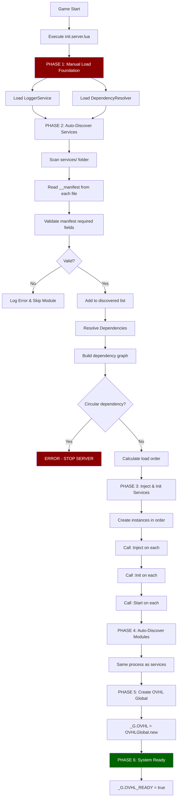
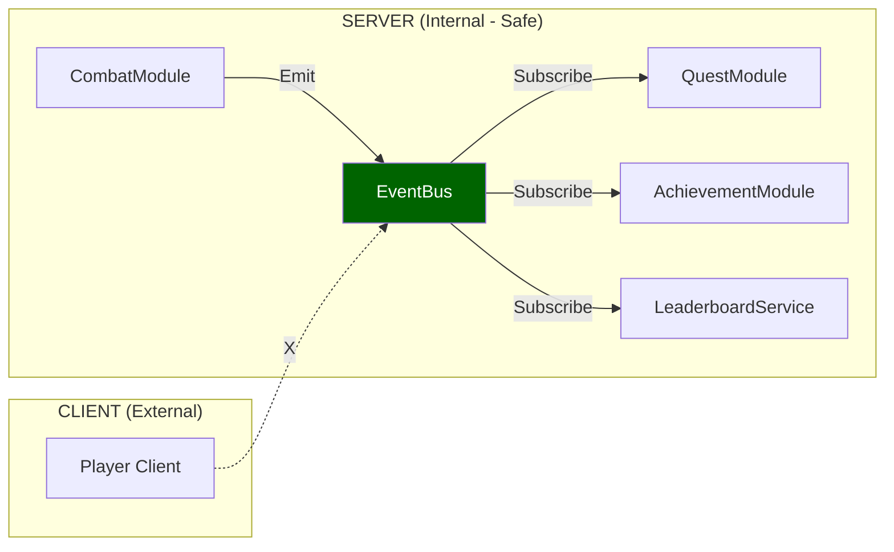
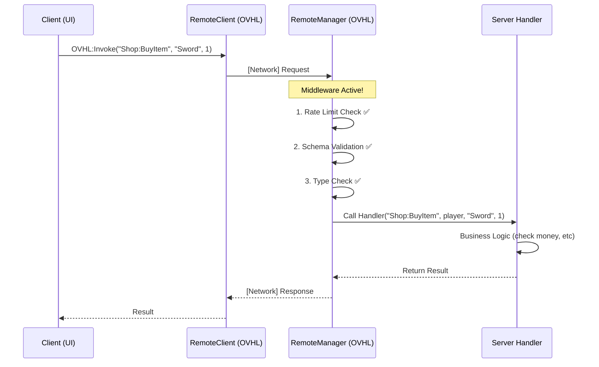

# 🏛️ 01 - ARSITEKTUR INTI (OVHL v1)

### 📋 INFORMASI DOKUMEN

| Properti           | Nilai                                      |
| ------------------ | ------------------------------------------ |
| **ID Dokumen**     | `ARC-v1-001-R2`                            |
| **Status**         | `Aktif (Revised for AI)`                   |
| **Lokasi Path**    | `./docs/blueprint/01_ARCHITECTURE_CORE.md` |
| **Tipe Dokumen**   | `Core Architecture - PRIMARY AI REFERENCE` |
| **Target Audiens** | `AI Assistant, Core Dev, Module Dev`       |
| **Penulis**        | `OVHL Core Team (AI-Optimized v2)`         |
| **Dibuat**         | `29 Oktober 2025`                          |
| **Revisi**         | `29 Oktober 2025 - Fixed Auto-Discovery`   |

---

## 🎯 1. FILOSOFI & VISI INTI

OVHL v1 adalah **ekosistem pengembangan game Roblox** yang memprioritaskan:

1. **🔥 Auto-Discovery**: "Tinggal Taruh, Langsung Jalan"
2. **🔒 API Sederhana**: Satu global accessor (`OVHL`)
3. **⚖️ Pemisahan Coder/Builder**: Workflow berbasis Tag
4. **⚠️ No Crash**: Graceful degradation
5. **🤖 SDK/AI Ready**: Struktur eksplisit untuk tooling

---

## 🗺️ 2. STRUKTUR FOLDER (ROJO MAPPING)

```
📦 PROJECT ROOT/
├── 📁 src/
│   ├── 📁 server/
│   │   ├── 📄 init.server.lua          ← BOOTSTRAP (Manual)
│   │   ├── 📁 services/                ← AUTO-DISCOVERED
│   │   │   ├── 📄 LoggerService.lua    ← Manual load (foundation)
│   │   │   ├── 📄 DependencyResolver.lua ← Manual load (foundation)
│   │   │   ├── 📄 ConfigService.lua    ← Auto-discovered
│   │   │   ├── 📄 EventBusService.lua  ← Auto-discovered
│   │   │   └── 📄 RemoteManagerService.lua
│   │   └── 📁 modules/                 ← AUTO-DISCOVERED
│   │       ├── 📄 ShopModule.lua
│   │       └── 📄 QuestModule.lua
│   │
│   ├── 📁 client/
│   │   ├── 📄 init.client.lua          ← BOOTSTRAP (Manual)
│   │   ├── 📁 controllers/             ← AUTO-DISCOVERED
│   │   │   ├── 📄 StateManager.lua
│   │   │   ├── 📄 RemoteClient.lua
│   │   │   └── 📄 UIEngine.lua
│   │   └── 📁 modules/                 ← AUTO-DISCOVERED
│   │       ├── 📄 HUDModule.lua
│   │       └── 📄 InventoryUI.lua
│   │
│   └── 📁 shared/
│       ├── 📄 OVHL_Global.lua          ← API Accessor
│       ├── 📁 components/              ← AUTO-DISCOVERED
│       │   ├── 📄 SpinningCoin.lua
│       │   └── 📄 LavaPart.lua
│       ├── 📁 constants/
│       ├── 📁 utils/
│       ├── 📄 NetworkSchema.lua
│       └── 📁 lib/                     ← Wally packages
│
├── 📄 default.project.json             ← Rojo config
└── 📄 wally.toml                       ← Dependencies
```

### 🔑 KEY CONCEPTS:

| Folder Type    | Discovery Method | Loaded By        | When                           |
| -------------- | ---------------- | ---------------- | ------------------------------ |
| `services/`    | Auto-scan        | init.server.lua  | Server startup (Phase 2)       |
| `modules/`     | Auto-scan        | init.server.lua  | After services ready (Phase 4) |
| `controllers/` | Auto-scan        | init.client.lua  | Client startup (Phase 2)       |
| `components/`  | Auto-scan        | ComponentService | After server ready (Phase 5)   |

**CRITICAL RULE:**

- ❌ **NEVER** manually `require()` services/modules in bootstrap
- ✅ **ALWAYS** let auto-discovery scan folders and load them

---

## 🔥 3. AUTO-DISCOVERY SYSTEM (JANTUNG FRAMEWORK)

### 3.1. BOOTSTRAP FLOW (CORRECT)



### 3.2. DETAILED PHASES EXPLANATION

#### **PHASE 1: MANUAL LOAD (Fail Fast)**

```lua
-- File: src/server/init.server.lua

-- These are loaded MANUALLY because everything depends on them
local LoggerService = require(script.services.LoggerService)
local DependencyResolver = require(script.services.DependencyResolver)

local logger = LoggerService.new()
logger:Init()

local resolver = DependencyResolver.new(logger)
```

**WHY MANUAL?**

- Logger = Foundation for error reporting
- DependencyResolver = Foundation for auto-discovery
- If these fail → Server MUST stop (Fail Fast)

---

#### **PHASE 2: AUTO-DISCOVER SERVICES**

```lua
-- File: src/server/init.server.lua (continued)

local function AutoDiscoverServices(servicesFolder, logger, resolver)
    local discovered = {}

    -- 1. SCAN FOLDER
    for _, moduleScript in ipairs(servicesFolder:GetChildren()) do
        if not moduleScript:IsA("ModuleScript") then continue end

        -- Skip manually loaded
        if moduleScript.Name == "LoggerService" or
           moduleScript.Name == "DependencyResolver" then
            continue
        end

        -- 2. REQUIRE MODULE
        local success, serviceModule = pcall(require, moduleScript)
        if not success then
            logger:Error("Failed to require: " .. moduleScript.Name, serviceModule)
            continue -- FAIL GRACEFUL
        end

        -- 3. VALIDATE MANIFEST
        if not serviceModule.__manifest then
            logger:Warn("Missing __manifest: " .. moduleScript.Name)
            continue -- FAIL GRACEFUL
        end

        local manifest = serviceModule.__manifest

        -- Validate required fields
        if not manifest.name or not manifest.version or not manifest.type then
            logger:Error("Invalid manifest: " .. moduleScript.Name)
            continue -- FAIL GRACEFUL
        end

        -- Validate name matches filename
        if manifest.name ~= moduleScript.Name then
            logger:Error("Name mismatch: " .. moduleScript.Name .. " vs " .. manifest.name)
            continue -- FAIL GRACEFUL
        end

        -- 4. ADD TO DISCOVERED LIST
        table.insert(discovered, {
            name = manifest.name,
            module = serviceModule,
            manifest = manifest,
            instance = nil -- Will be created after sorting
        })
    end

    -- 5. RESOLVE DEPENDENCIES
    local loadOrder = resolver:Resolve(discovered)

    if not loadOrder then
        error("❌ Circular dependency or missing dependency!") -- FAIL FAST
    end

    logger:Info("Load order: " .. table.concat(loadOrder, " → "))

    return discovered, loadOrder
end

local discoveredServices, serviceLoadOrder = AutoDiscoverServices(
    script.services,
    logger,
    resolver
)
```

**KEY POINTS:**

- ✅ Scan folder automatically
- ✅ Validate manifest before loading
- ✅ Skip invalid modules (Fail Graceful)
- ✅ Calculate dependency order
- ❌ Circular dependency = Stop server (Fail Fast)

---

#### **PHASE 3: INJECT & INIT SERVICES**

```lua
-- File: src/server/init.server.lua (continued)

-- Create instances
local serviceInstances = {
    Logger = logger, -- Add manually loaded
    DependencyResolver = resolver
}

for _, serviceName in ipairs(serviceLoadOrder) do
    local serviceData = FindInDiscovered(serviceName, discoveredServices)

    if serviceData then
        local success, instance = pcall(function()
            return serviceData.module.new(logger)
        end)

        if success then
            serviceInstances[serviceName] = instance
        else
            logger:Error("Failed to create: " .. serviceName, instance)
            -- Continue anyway (Fail Graceful)
        end
    end
end

-- Call :Inject() on each
for _, serviceName in ipairs(serviceLoadOrder) do
    local instance = serviceInstances[serviceName]
    if instance and instance.Inject then
        pcall(function()
            instance:Inject(serviceInstances)
        end)
    end
end

-- Call :Init() on each
for _, serviceName in ipairs(serviceLoadOrder) do
    local instance = serviceInstances[serviceName]
    if instance and instance.Init then
        pcall(function()
            instance:Init()
        end)
    end
end

-- Call :Start() on each (async)
for _, serviceName in ipairs(serviceLoadOrder) do
    local instance = serviceInstances[serviceName]
    if instance and instance.Start then
        task.spawn(function()
            pcall(function()
                instance:Start()
            end)
        end)
    end
end
```

**LIFECYCLE METHODS:**

| Method              | Purpose          | Can Access Services? | Runs Async?         |
| ------------------- | ---------------- | -------------------- | ------------------- |
| `.new(logger)`      | Create instance  | ❌ No                | ❌ No               |
| `:Inject(services)` | Get dependencies | ✅ Yes               | ❌ No               |
| `:Init()`           | Setup state      | ✅ Yes               | ❌ No               |
| `:Start()`          | Start async work | ✅ Yes               | ✅ Yes (task.spawn) |

---

#### **PHASE 4: AUTO-DISCOVER MODULES**

```lua
-- File: src/server/init.server.lua (continued)

-- Same process as services, but scan modules/ folder
local discoveredModules, moduleLoadOrder = AutoDiscoverModules(
    script.modules,
    logger,
    resolver,
    serviceInstances -- Pass services so modules can depend on them
)

-- Inject, Init, Start modules (same as services)
-- ...
```

---

#### **PHASE 5: CREATE OVHL GLOBAL**

```lua
-- File: src/server/init.server.lua (continued)

local OVHL_Shared = game:GetService("ReplicatedStorage"):WaitForChild("OVHL_Shared")
local OVHLGlobal = require(OVHL_Shared.OVHL_Global)

_G.OVHL = OVHLGlobal.new({
    services = serviceInstances,
    modules = moduleInstances,
    logger = logger
})

logger:Info("🎉 OVHL Server Ready!")
_G.OVHL_READY = true
```

---

## 📦 4. MODULE STRUCTURE (MANDATORY PATTERN)

### 4.1. MANIFEST (REQUIRED)

```lua
-- File: src/server/services/ConfigService.lua

local ConfigService = {}
ConfigService.__index = ConfigService

-- ============================================
-- MANIFEST (WAJIB - Auto-Discovery KTP)
-- ============================================
ConfigService.__manifest = {
    name = "ConfigService",              -- MUST match filename!
    version = "1.0.0",                   -- SemVer
    type = "service",                    -- service|controller|module|component
    dependencies = {"Logger"},           -- Dependencies (by name)
    priority = 60,                       -- Load order (0-100, higher = earlier)
    domain = "core",                     -- Category
    description = "Manages game configuration and live config updates"
}
```

**VALIDATION RULES:**

| Field          | Type   | Required? | Validation                                      |
| -------------- | ------ | --------- | ----------------------------------------------- |
| `name`         | string | ✅ Yes    | Must match ModuleScript.Name exactly            |
| `version`      | string | ✅ Yes    | Must be valid SemVer (e.g. "1.0.0")             |
| `type`         | string | ✅ Yes    | Must be: service, controller, module, component |
| `dependencies` | table  | ❌ No     | Array of strings (dependency names)             |
| `priority`     | number | ❌ No     | 0-100, default 50                               |
| `domain`       | string | ❌ No     | Category for organization                       |
| `description`  | string | ❌ No     | Human-readable description                      |

---

### 4.2. CONFIG (OPTIONAL BUT RECOMMENDED)

```lua
-- File: src/server/services/ConfigService.lua (continued)

-- ============================================
-- CONFIG (OPSIONAL - Default Settings)
-- ============================================
ConfigService.__config = {
    AutoSaveInterval = 300,              -- Auto-save every 5 minutes
    EnableLiveConfigUpdates = true,      -- Allow admin panel changes
    DefaultGameMode = "Survival",
    MaxPlayers = 50
}
```

**PURPOSE:**

- Store default configuration
- No hardcoded values in code
- Can be overridden by Admin Panel (live config)
- Accessed via `OVHL:GetConfig("ConfigService")`

---

### 4.3. LIFECYCLE METHODS (PATTERN)

```lua
-- File: src/server/services/ConfigService.lua (continued)

-- ============================================
-- CONSTRUCTOR (REQUIRED)
-- ============================================
function ConfigService.new(logger)
    local self = setmetatable({}, ConfigService)
    self.logger = logger
    -- DON'T access other services here!
    return self
end

-- ============================================
-- INJECT (OPTIONAL - for dependencies)
-- ============================================
function ConfigService:Inject(services)
    -- Get other services you depend on
    self.dataService = services.DataService
    self.eventBus = services.EventBus
end

-- ============================================
-- INIT (OPTIONAL - setup state)
-- ============================================
function ConfigService:Init()
    -- Initialize internal state
    self.configs = {}

    -- Load default configs from __config
    if self.__config then
        self.configs["ConfigService"] = self.__config
    end

    -- Return false to abort loading this service
    -- return false
end

-- ============================================
-- START (OPTIONAL - async work)
-- ============================================
function ConfigService:Start()
    -- Start event listeners, timers, etc
    -- This runs in task.spawn (async)

    self.eventBus:Subscribe("ConfigChanged", function(configName, newValue)
        self:UpdateConfig(configName, newValue)
    end)
end

-- ============================================
-- PUBLIC API
-- ============================================
function ConfigService:GetConfig(moduleName)
    return self.configs[moduleName]
end

function ConfigService:SetConfig(moduleName, config)
    self.configs[moduleName] = config
    self.eventBus:Emit("ConfigChanged", moduleName, config)
end

return ConfigService
```

---

## 🔗 5. COMMUNICATION PATTERNS

### 5.1. INTERNAL (SERVER-ONLY): EventBus



**USAGE:**

```lua
-- Publisher (CombatModule)
OVHL:Emit("EnemyKilled", {
    enemyName = "Zombie",
    xpReward = 50,
    killer = player
})

-- Subscriber (QuestModule)
OVHL:Subscribe("EnemyKilled", function(data)
    self:UpdateQuest(data.killer, "KillZombies", 1)
end)
```

**SECURITY:** ✅ Safe (server-only, no client access)

---

### 5.2. EXTERNAL (CLIENT ↔ SERVER): RemoteManager



**USAGE (SERVER):**

```lua
-- Register handler (in ShopModule:Start)
local RemoteManager = OVHL:GetService("RemoteManager")

RemoteManager:RegisterHandler("Shop:BuyItem", function(player, itemName, quantity)
    -- This is already validated by RemoteManager!
    -- Just focus on business logic

    local success, message = self:ProcessPurchase(player, itemName, quantity)
    return {
        success = success,
        message = message
    }
end)
```

**USAGE (CLIENT):**

```lua
-- Invoke from UI (in ShopUI module)
local result = OVHL:Invoke("Shop:BuyItem", "Sword", 1)

if result.success then
    print("Purchase successful!")
else
    print("Purchase failed:", result.message)
end
```

**SECURITY:**

- ✅ Automatic validation via NetworkSchema.lua
- ✅ Rate limiting (prevent spam)
- ✅ Type checking (prevent exploits)

---

## ⚠️ 6. ERROR HANDLING PHILOSOPHY

### 6.1. FAIL FAST (Critical Errors)

**WHEN:**

- Foundation services fail to load (Logger, DependencyResolver)
- Circular dependency detected
- Invalid Rojo structure
- Critical config missing

**ACTION:**

```lua
error("❌ [OVHL] Critical error: " .. message)
-- Server stops immediately
```

---

### 6.2. FAIL GRACEFUL (Feature Errors)

**WHEN:**

- Module/service fails to load
- Runtime error in event handler
- Network request fails
- Component error

**ACTION:**

```lua
local success, err = pcall(function()
    -- Potentially dangerous code
end)

if not success then
    logger:Error("Module failed", err)
    -- Continue execution, mark module as failed
end
```

---

## 🤖 7. AI ASSISTANT INSTRUCTIONS

### 7.1. WHEN GENERATING NEW SERVICE/MODULE

**CHECKLIST:**

- [ ] File is in correct folder (`services/` or `modules/`)
- [ ] Has `__manifest` with all required fields
- [ ] `name` matches filename exactly
- [ ] Has `.new(logger)` constructor
- [ ] Uses `:Inject()` to get dependencies
- [ ] Uses `:Init()` for setup
- [ ] Uses `:Start()` for async work
- [ ] All errors wrapped in `pcall`
- [ ] All errors logged via `logger:Error()`
- [ ] No hardcoded values (use `__config`)

---

### 7.2. NEVER DO THIS

❌ **Manual registration in bootstrap:**

```lua
-- WRONG - Don't do this!
local ConfigService = require(...)
local EventBus = require(...)
serviceManager:Register("Config", ConfigService)
```

❌ **Access services in constructor:**

```lua
-- WRONG - Services don't exist yet!
function MyService.new(logger)
    self.eventBus = OVHL:GetService("EventBus") -- FAILS!
end
```

❌ **Start async work in :Init():**

```lua
-- WRONG - Use :Start() instead!
function MyService:Init()
    task.spawn(function()
        while true do
            self:DoWork()
            task.wait(1)
        end
    end)
end
```

---

### 7.3. ALWAYS DO THIS

✅ **Let auto-discovery handle loading:**

```lua
-- CORRECT - Just create file in services/ folder
-- Framework will auto-discover and load it
```

✅ **Access services in :Inject():**

```lua
-- CORRECT - Services are ready now!
function MyService:Inject(services)
    self.eventBus = services.EventBus
    self.config = services.ConfigService
end
```

✅ **Start async work in :Start():**

```lua
-- CORRECT - This runs in task.spawn automatically
function MyService:Start()
    while true do
        self:DoWork()
        task.wait(1)
    end
end
```

---

## 📊 8. DEPENDENCY CHAIN REFERENCE

```
FOUNDATION (Manual Load - Fail Fast):
    Logger
    └── DependencyResolver

CORE SERVICES (Auto-Discover - Fail Graceful):
    ├── ConfigService (depends: Logger)
    ├── EventBusService (depends: Logger)
    ├── DataService (depends: Logger, ConfigService)
    └── RemoteManagerService (depends: Logger, EventBus, NetworkSchema)

NETWORKING:
    └── RemoteClient (depends: Logger, NetworkSchema)

UI FRAMEWORK:
    ├── StateManager (depends: Logger, Fusion)
    ├── UIEngine (depends: Logger, StateManager, Fusion)
    └── ThemeController (depends: StateManager)

GAME MODULES:
    ├── ShopModule (depends: Logger, DataService, RemoteManager)
    ├── QuestModule (depends: Logger, EventBus, DataService)
    └── AdminPanelModule (depends: Logger, ConfigService, RemoteManager)

COMPONENTS:
    └── ComponentService (depends: Logger, EventBus, CollectionService)
        ├── SpinningCoin (pattern: ovhl:component)
        └── LavaPart (pattern: ovhl:component)
```

---

## 📝 CHANGELOG

| Version | Date        | Changes                                                              |
| ------- | ----------- | -------------------------------------------------------------------- |
| 1.0.0   | 29 Oct 2025 | Initial release                                                      |
| 2.0.0   | 29 Oct 2025 | AI-Optimized: Added bootstrap flow, detailed phases, AI instructions |

---

**END OF DOCUMENT**
