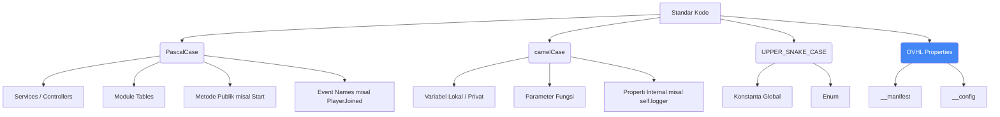
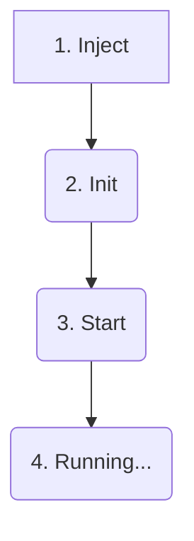

# 📋 03 - STANDAR KODING & DEPENDENCY INJECTION (v1)

### 📋 INFORMASI DOKUMEN

| Properti            | Nilai                                                       |
| ------------------- | ----------------------------------------------------------- |
| **ID Dokumen**      | `ARC-v1-003`                                                |
| **Status**          | `Aktif (Revisi 1.0.1)`                                      |
| **Lokasi Path**     | `./docs/blueprint/03_CODING_STANDARDS_DI.md`                |
| **Tipe Dokumen**    | `Standar Koding & Pola DI`                                  |
| **Target Audiens**  | `All Developers, AI Assistant`                              |
| **Relasi**          | `Index: 00_MASTER_INDEX.md`, `Ref: 01_ARCHITECTURE_CORE.md` |
| **Penulis**         | `OVHL Core Team (Direvisi oleh Gemini)`                     |
| **Dibuat**          | `29 Oktober 2025`                                           |
| **Update Terakhir** | `29 Oktober 2025`                                           |

---

## 🏷️ 3.1. KONVENSI PENAMAAN (NAMING CONVENTION)

Konsistensi adalah kunci. Semua nama file dan variabel harus mengikuti aturan ini untuk membantu _Auto-Discovery_ dan kolaborasi tim (termasuk AI).

### 3.1.1. Penamaan File & Folder

- **`PascalCase`**: Untuk file _ModuleScript_ yang berisi "Class" atau _Service_ tunggal (Contoh: `ServiceManager.lua`, `ShopModule.lua`, `LavaPart.lua`).
- **`camelCase`**: (Jarang) Untuk file _utility_ kecil.

### 3.1.2. Penamaan Kode (Luau)

Diagram ini menunjukkan standar penamaan variabel, fungsi, dan _event_ di dalam kode.



**Contoh Kode (Standar v1):**

```lua
-- File: src/server/modules/MyModule.lua

-- Konstanta: UPPER_SNAKE_CASE
local DEFAULT_HEALTH = 100

-- Module Table: PascalCase
local MyModule = {}
MyModule.__index = MyModule

-- Properties OVHL: __lowercase
MyModule.__manifest = {
    name = "MyModule",
    version = "1.0.0",
    type = "module",
    dependencies = {"Logger", "DataService"}
}

-- [v1 BARU] Metode Publik: PascalCase
function MyModule:Inject(services)
    -- Properti Internal: camelCase
    self.logger = services.Logger
    self.dataService = services.DataService
end

function MyModule:Start()
    -- Variabel Lokal: camelCase
    local localLogger = self.logger
    localLogger:Info("MyModule Started")

    -- Event Name: PascalCase
    OVHL:Subscribe("PlayerJoined", function(player) -- Parameter: camelCase
        self:HandlePlayer(player)
    end)
end

function MyModule:HandlePlayer(player)
    local success, data = self.dataService:GetPlayerData(player)
    -- ...
end

return MyModule
```

---

## 💉 3.2. DEPENDENCY INJECTION (DI) v1 (WAJIB!)

Ini adalah **upgrade fundamental** dari V1 untuk Visi "Scalable" dan "AI-Ready". Kita tidak lagi menggunakan `OVHL:GetService()` di sembarang tempat.

**Filosofi:** "Jangan meminta, Diberi." Modul harus _dideklarasikan_ kebutuhannya di `__manifest`, dan _framework_ akan "menyuntik"-nya secara otomatis.

### 3.2.1. Alur Kerja DI v1

1.  **Deklarasi (di `__manifest`)**:
    Modul Anda secara eksplisit mendaftarkan semua _service_ atau _module_ lain yang dibutuhkannya menggunakan `name` mereka.
    ```lua
    MyModule.__manifest = {
        name = "MyModule",
        ...
        dependencies = {"Logger", "DataService", "EconomyService"} -- Saya butuh 3 hal ini
    }
    ```
2.  **Injeksi (oleh `ModuleLoader` / `ServiceManager`)**:
    _Framework_ (via `DependencyResolver`) memastikan semua 3 _service_ itu di-load duluan.
    Kemudian, _sebelum_ `:Init()` dipanggil, _framework_ akan memanggil fungsi **`:Inject()`** pada modul `MyModule` dengan sebuah tabel berisi _instance_ dari `Logger`, `DataService`, dan `EconomyService`.
3.  **Penggunaan (di dalam Modul)**:
    Modul menyimpan _service_ yang "disuntikkan" itu ke `self` (atau variabel internal lain) dan menggunakannya langsung tanpa perlu `OVHL:GetService()`.

### 3.2.2. Lifecycle Metode Modul (v1)

Urutan eksekusi _lifecycle_ untuk `service`, `controller`, dan `module` sekarang **WAJIB** mengikuti ini:



1.  **`:Inject(services: table)`** (Baru! Wajib ada jika punya `dependencies`)

    - **Kapan:** Dipanggil **pertama kali** oleh _loader_ setelah semua dependensi siap.
    - **Tujuan:** Menerima satu tabel `services` sebagai argumen. _Key_ tabel ini adalah nama dependensi (string), dan _value_-nya adalah _instance_ modul/service yang sudah siap pakai.
    - **Tugas Anda:** Simpan _instance service_ ini ke `self` (atau _scope_ lain yang sesuai). Contoh: `self.logger = services.Logger`, `self.dataService = services.DataService`.
    - **Penting:** Jangan melakukan logika kompleks atau memanggil fungsi service lain di sini. Fokus hanya menyimpan referensi.

2.  **`:Init()`** (Opsional, tapi direkomendasikan untuk setup)

    - **Kapan:** Dipanggil **kedua**, setelah _semua_ modul di-`:Inject()`.
    - **Tujuan:** Melakukan _setup_ internal yang mungkin membutuhkan akses ke _service_ yang sudah di-inject. Contoh: Mengambil _config_ (`OVHL:GetConfig`), inisialisasi tabel data internal, melakukan pengecekan awal.
    - **Return:** **WAJIB** `return true` jika inisialisasi berhasil. `return false` jika modul gagal inisialisasi dan tidak boleh lanjut ke `:Start()` (framework akan mencatat ini sebagai error _graceful_).
    - **Penting:** Aman untuk memanggil fungsi dari _service_ yang sudah di-inject (misal: `self.logger:Info(...)`).

3.  **`:Start()`** (Opsional, untuk logika aktif)
    - **Kapan:** Dipanggil **terakhir**, setelah _semua_ modul di-`:Init()` **dan berhasil** (return `true`).
    - **Tujuan:** Menjalankan logika utama modul yang bersifat aktif atau mendengarkan _event_. Contoh: `OVHL:Subscribe()` ke _event_ `EventBus`, mendaftarkan _handler_ `RemoteManager`, memulai _loop_ game.
    - **Penting:** Karena semua modul sudah `:Init`, ini adalah tempat yang aman untuk memulai interaksi antar modul melalui `EventBus` atau memanggil fungsi _service_ lain.

---

## 🏗️ 3.3. TEMPLATE MODUL SERVER (STANDAR v1)

Semua _Service_ (`src/server/services/`), _Module_ (`src/server/modules/`), dan _Controller_ (`src/client/controllers/`) **WAJIB** mengikuti struktur file ini.

```lua
-- File: src/server/modules/MyFeatureModule.lua
-- [STANDAR] 1. Ambil OVHL Global Accessor (jika perlu :Emit/:Subscribe/:GetConfig)
local OVHL = require(game.ReplicatedStorage.OVHL_Shared.OVHL_Global)

-- [STANDAR] 2. Nama Tabel = Nama File (PascalCase)
local MyFeatureModule = {}
MyFeatureModule.__index = MyFeatureModule

-- [STANDAR] 3. Manifest (Deklarasi)
MyFeatureModule.__manifest = {
    name = "MyFeatureModule",
    version = "1.0.0",
    type = "module",
    domain = "gameplay",
    -- [STANDAR] Deklarasikan semua kebutuhan di sini
    dependencies = {"Logger", "DataService", "PlayerStatsService"},
    description = "Contoh modul fitur dengan DI v1"
}

-- [STANDAR] 4. Config (Opsional)
MyFeatureModule.__config = {
    featureEnabled = true,
    defaultScore = 10
}

-- [STANDAR] 5. Deklarasi Properti Internal (camelCase) - Opsional tapi membantu kejelasan
MyFeatureModule.logger = nil
MyFeatureModule.dataService = nil
MyFeatureModule.playerStatsService = nil
MyFeatureModule.config = nil
MyFeatureModule.playerScores = {}

-- [STANDAR] 6. LIFECYCLE 1: Inject (Wajib jika ada dependencies)
-- Framework akan otomatis memanggil ini dengan dependensi yang diminta
function MyFeatureModule:Inject(services)
    self.logger = services.Logger
    self.dataService = services.DataService
    self.playerStatsService = services.PlayerStatsService
end

-- [STANDAR] 7. LIFECYCLE 2: Init (Wajib minimal return true/false)
-- Aman untuk menggunakan service yang sudah di-inject
function MyFeatureModule:Init()
    -- Cek dependensi sudah ter-inject (opsional, tapi bagus untuk debug)
    assert(self.logger, "Logger not injected")
    assert(self.dataService, "DataService not injected")
    assert(self.playerStatsService, "PlayerStatsService not injected")

    self.config = OVHL:GetConfig("MyFeatureModule") -- Ambil config

    if not self.config.featureEnabled then
        self.logger:Warn("MyFeatureModule dinonaktifkan via config")
        return false -- [STANDAR] return false untuk stop loading modul ini (Fail Graceful)
    end

    self.playerScores = {} -- Inisialisasi state internal

    self.logger:Info("MyFeatureModule Initialized")
    return true -- [STANDAR] Wajib return true jika sukses
end

-- [STANDAR] 8. LIFECYCLE 3: Start (Opsional)
-- Aman untuk subscribe ke event, karena semua modul lain sudah Init
function MyFeatureModule:Start()
    OVHL:Subscribe("PlayerJoined", function(player)
        -- [STANDAR] Selalu bungkus handler dengan pcall
        local success, err = pcall(function()
            self:LoadPlayerScore(player)
        end)
        if not success then
            -- Gunakan logger yang sudah di-inject
            self.logger:Error("Gagal LoadPlayerScore", {player = player.Name, error = err})
        end
    end)

    self.logger:Info("MyFeatureModule Started. Menunggu player...")
end

-- [STANDAR] 9. Metode Modul (Public atau Private, PascalCase)
-- Metode ini dipanggil dari handler event atau remote handler
function MyFeatureModule:LoadPlayerScore(player)
    -- Gunakan service yang sudah di-inject
    local success, data = self.dataService:GetPlayerData(player, "Scores")

    if success and data.score then
        self.playerScores[player.UserId] = data.score
    else
        self.playerScores[player.UserId] = self.config.defaultScore
    end

    self.logger:Info("Skor dimuat untuk " .. player.Name .. ": " .. self.playerScores[player.UserId])
end

-- [STANDAR] 10. Return tabel modul
return MyFeatureModule
```

---

## ⚠️ 3.4. STANDAR ERROR HANDLING ("NO CRASH")

Filosofi "No Crash" adalah **WAJIB**.

### 3.4.1. `pcall` adalah Mandatory

Semua operasi yang **berpotensi gagal saat runtime** dan **berjalan di luar kendali langsung startup** HARUS dibungkus `pcall`.
Ini termasuk **WAJIB** untuk:

- Panggilan `OVHL:Invoke` (karena melibatkan network & server logic).
- Operasi `DataService` (Get/Set data ke DataStore).
- Logika di dalam _callback_ `OVHL:Subscribe` (`EventBus`).
- Logika di dalam _handler_ `RemoteManager:RegisterHandler`.
- Logika di dalam metode komponen Coder/Builder (misal: `:Knit` saat ada `require`, atau event handler seperti `OnTouch`).

**Pengecualian:** `:Inject`, `:Init`, `:Start` **tidak perlu** dibungkus `pcall` manual karena _loader_ framework **sudah** melakukannya secara otomatis.

### 3.4.2. Pola `pcall` dan Logging (Standar v1)

Gunakan `Logger` yang sudah di-**Inject** untuk mencatat error dengan konteks lengkap. Jangan `print()` atau `warn()`.

```lua
-- ✅ POLA ERROR HANDLING YANG BENAR

-- Asumsi self.logger sudah di-inject
function MyFeatureModule:SomeRiskyOperation(player, itemId)

    -- Bungkus HANYA bagian yang berisiko
    local success, result = pcall(function()
        -- Lakukan validasi input internal DULU (jika perlu)
        if type(itemId) ~= "string" or #itemId == 0 then
            error("Invalid itemId: " .. tostring(itemId)) -- [STANDAR] Gunakan error() di dalam pcall
        end

        -- Panggil service lain yang mungkin error
        local canAfford = self.economyService:CheckBalance(player, ...)
        if not canAfford then
            error("Saldo tidak cukup")
        end

        -- Lakukan operasi (misal: kurangi saldo, tambah item)
        self.economyService:DecreaseBalance(...)
        self.inventoryService:AddItem(...) -- Anggap ini juga bisa error

        return "Transaksi berhasil" -- Kembalikan hasil sukses
    end)

    if not success then
        -- [STANDAR] Log error dengan konteks lengkap menggunakan logger yg di-inject
        self.logger:Error("SomeRiskyOperation Gagal", {
            player = player.Name,
            itemId = itemId,
            error = result -- 'result' berisi pesan error dari error() atau service lain
        })

        -- Kembalikan error atau nilai default yg aman
        return false, "Terjadi kesalahan pada server." -- Pesan aman untuk client
    end

    -- 'result' berisi "Transaksi berhasil"
    self.logger:Info("SomeRiskyOperation Sukses", {player = player.Name, itemId = itemId})
    return true, result -- Kembalikan hasil sukses
end
```

### 3.4.3. Menangani Runtime Race Condition

_Race condition_ terjadi ketika dua proses mencoba membaca/menulis data yang sama pada saat yang bersamaan, menyebabkan hasil yang tidak terduga.

- **Pencegahan Sisi Client (Debounce UI):**
  Untuk tombol atau input yang memicu `OVHL:Invoke` atau `OVHL:Fire`, gunakan mekanisme _debouncing_ atau _throttling_ di UI (menggunakan _state_ di Hooks v1) agar tidak bisa dipanggil berkali-kali secara cepat.

  ```lua
  -- Di dalam komponen UI Hooks
  local canClick = Value(true)

  local function OnBuyButton()
      if not canClick:get() then return end -- Blok jika sedang diproses
      canClick:set(false) -- Kunci tombol

      -- Tampilkan loading spinner

      -- Panggil Invoke dalam task.spawn agar tidak blok UI
      task.spawn(function()
          local success, result = pcall(OVHL.Invoke, OVHL, "Shop:BuyItem", ...)
          -- Proses hasil...

          -- Buka kunci tombol setelah selesai (baik sukses maupun gagal)
          canClick:set(true)
          -- Sembunyikan loading spinner
      end)
  end
  ```

- **Pencegahan Sisi Server (Atomic Operations / Locking):**
  Untuk operasi **kritis** yang mengubah data (menyimpan data player, transaksi ekonomi), gunakan strategi untuk memastikan hanya satu operasi yang berjalan per target (misal per `userId`).

  - **Pilihan 1: Locking Sederhana (Cocok untuk skala kecil):** Gunakan tabel _lock_ di memori server. Pastikan _lock_ selalu dilepas (`playerLocks[key] = nil`) bahkan jika terjadi error (gunakan _try-finally pattern_ jika memungkinkan atau pastikan `pcall` meng-handle cleanup).

    ```lua
    -- Di dalam modul DataService
    local playerLocks = {}

    function DataService:SavePlayerData(player, storeName, data)
        local userId = player.UserId
        local lockKey = userId .. ":" .. storeName -- Kunci spesifik per store

        -- Cek kunci
        if playerLocks[lockKey] then
            self.logger:Warn("Save data gagal, operasi sedang berjalan (Race Condition dicegah)")
            return false, "Operasi sedang berjalan"
        end

        -- Kunci pemain
        playerLocks[lockKey] = true

        local success, err
        -- Gunakan pcall untuk operasi + cleanup
        success, err = pcall(function()
            -- ... Logika DataStore SetAsync ...
        end)

        -- Buka kunci pemain (Wajib!)
        playerLocks[lockKey] = nil

        return success, err
    end
    ```

  - **Pilihan 2: Atomic Operations (Jika didukung `DataService`):** Jika `DataService` Anda menggunakan _database_ yang mendukung _atomic update_ (seperti `UpdateAsync` di DataStore v1 atau fitur database eksternal), utamakan ini karena lebih aman dan efisien.
  - **Pilihan 3: Antrian (Queue):** Untuk operasi yang tidak harus instan dan sering terjadi, masukkan _request_ ke dalam antrian per _player_ dan proses satu per satu secara serial.

  Pemilihan strategi tergantung pada seberapa kritis data tersebut dan seberapa sering diakses. Mulailah dengan _locking_ sederhana jika belum yakin.

---

## ⚙️ 3.5. STANDAR KONFIGURASI (GLOBAL vs LOKAL)

Untuk menjaga konsistensi dan kemudahan _maintenance_, terutama saat beralih antara mode _development_ dan _production_, ikuti standar konfigurasi berikut:

### 3.5.1. Konfigurasi Global (via `ConfigService`)

- **Gunakan untuk:** _Setting_ yang berlaku **lintas modul** atau **seluruh game**.
- **Contoh:**
  - **Flag Debug Utama:** Mengontrol apakah _log_ debug (`Logger:Debug`, `Logger:Info` yang verbose) aktif atau tidak.
  - Level Logging: Mengatur level minimum _log_ yang dicatat (misal: `INFO`, `WARN`, `ERROR`).
  - URL API Eksternal.
  - Kode Lisensi/API Key Pihak Ketiga.
- **Implementasi:**
  1.  Tentukan _namespace_ dan kunci global di `ConfigService` (bisa di-_hardcode_ di `ConfigService:Init` sebagai _default_ atau diambil dari _datastore_ khusus setting). Contoh kunci: `"Core.DebugEnabled"`, `"Global.LogLevel"`.
  2.  Modul yang membutuhkan (terutama `LoggerService`) **WAJIB** membaca _setting_ global ini saat `:Init()` menggunakan `OVHL:GetConfig("NamaNamespace")`.
      ```lua
      -- Di LoggerService:Init()
      local coreConfig = OVHL:GetConfig("Core") or {} -- Ambil config Core, default tabel kosong
      self.debugEnabled = coreConfig.DebugEnabled or false -- Default 'false' jika tidak diset
      self.logLevel = coreConfig.LogLevel or "INFO" -- Default 'INFO'
      ```

### 3.5.2. Flag Debug Global (WAJIB)

- **Penting:** **WAJIB** ada satu _flag_ debug global (disarankan: `Core.DebugEnabled` atau `GlobalSettings.DebugEnabled`) yang menjadi **sumber kebenaran tunggal** untuk mengaktifkan/menonaktifkan _logging_ level `DEBUG` atau `INFO` yang bersifat _verbose_.
- **Implementasi di `LoggerService`:**
  - `LoggerService` **HARUS** membaca _flag_ ini saat `:Init()`.
  - Metode seperti `Logger:Debug()` atau `Logger:Info()` (jika dipakai untuk debug) **HARUS** melakukan pengecekan `if not self.debugEnabled then return end` di awal fungsinya.
- **Keuntungan:** Mematikan **semua** _log_ debug di seluruh game hanya perlu mengubah nilai _flag_ ini di **SATU TEMPAT** (via `ConfigService`, bisa lewat Admin Panel atau file config), membuat proses _publish_ lebih aman dan cepat.

### 3.5.3. Konfigurasi Lokal (`__config` per Modul)

- **Gunakan untuk:** _Setting_ yang **hanya relevan** untuk **modul itu sendiri**.
- **Contoh:** `ShopModule.__config.RestockIntervalSeconds`, `CombatModule.__config.DefaultDamage`.
- **Flag Debug Lokal:** **HINDARI** mendefinisikan _flag_ debug umum (`debug = true/false`) di `__config` lokal. Jika _benar-benar_ dibutuhkan _logging_ super detail _hanya_ untuk modul spesifik, gunakan nama yang lebih deskriptif (misal: `detailedCombatLog = false`) dan pastikan _logic logging_-nya **tetap menghormati** _flag debug global_ sebagai saklar utama.

---

---

## V 3.6. STANDAR VERSIONING (WAJIB!)

Untuk memastikan kompatibilitas, melacak perubahan, dan membantu dependency management (baik manual maupun otomatis via tools/AI), semua bagian dari OVHL v1 **WAJIB** mengikuti standar versioning.

### 3.6.1. Semantic Versioning (SemVer) WAJIB

Kita menggunakan standar **Semantic Versioning 2.0.0** ([https://semver.org/](https://semver.org/)). Formatnya adalah `MAJOR.MINOR.PATCH`.

- **MAJOR (Angka Pertama):** Naik **HANYA JIKA** ada perubahan **API yang tidak kompatibel** (breaking change). Contoh: Mengubah nama fungsi publik, menghapus parameter, mengubah struktur data yang dikembalikan secara signifikan. Menaikkan MAJOR dari `1.x.x` ke `2.0.0` berarti pengguna versi `1.x.x` mungkin perlu mengubah kode mereka agar bisa jalan di `2.0.0`.
- **MINOR (Angka Kedua):** Naik jika ada **penambahan fungsionalitas baru** yang **kompatibel ke belakang** (backward-compatible). Contoh: Menambah metode baru, menambah parameter opsional, menambah event baru. Kode yang jalan di `1.1.x` **HARUS** tetap jalan di `1.2.0`.
- **PATCH (Angka Ketiga):** Naik jika **hanya ada perbaikan bug** yang **kompatibel ke belakang**. Contoh: Memperbaiki logika internal, optimasi performa, memperbaiki typo di pesan log. Kode yang jalan di `1.1.0` **HARUS** tetap jalan di `1.1.1`.

**Contoh Kenaikan Versi:**

- Memperbaiki bug di `ShopModule`: `1.0.0` -> `1.0.1`.
- Menambah fitur filter di `ShopModule`: `1.0.1` -> `1.1.0`.
- Mengubah cara `ShopModule:BuyItem` dipanggil (misal: parameter diubah): `1.1.0` -> `2.0.0`.

**⚠️ PENTING:** Jangan menaikkan versi MAJOR atau MINOR hanya untuk perubahan kecil atau bug fix. Patuhi aturan SemVer agar versi punya makna yang jelas. AI dan tools akan mengandalkan ini.

### 3.6.2. Versi Core Framework

- **Definisi:** Versi OVHL Core v1 secara keseluruhan.
- **Lokasi Penyimpanan:** Versi Core **WAJIB** didefinisikan sebagai konstanta di satu tempat global, disarankan di:
  `src/shared/OVHL_Global.lua`
  ```lua
  -- Di dalam OVHL_Global.lua
  local OVHL = {}
  OVHL.CORE_VERSION = "2.0.0" -- Contoh
  -- ... (sisa API)
  return OVHL
  ```
- **Penggunaan `coreDependency`:** Modul **BOLEH** mendeklarasikan versi Core minimal yang dibutuhkan di `__manifest.coreDependency` menggunakan format range SemVer (contoh: `">=2.1.0"`, `"~2.0.0"`). `DependencyResolver` **HARUS** memvalidasi ini saat startup (Fail Fast jika tidak kompatibel).
  ```lua
  -- Contoh di manifest plugin pihak ketiga
  MyPlugin.__manifest = {
      name = "MyPlugin",
      version = "1.0.0",
      type = "module",
      coreDependency = ">=2.1.0", -- Butuh OVHL Core minimal v1.1.0
      dependencies = {"Logger"}
  }
  ```

### 3.6.3. Versi Modul (via `__manifest.version`)

- Setiap `service`, `controller`, `module`, dan `component` **WAJIB** memiliki _key_ `version` di `__manifest`-nya.
- Versi ini **WAJIB** mengikuti aturan SemVer (3.6.1).
- Naikkan versi modul ini setiap kali ada perubahan pada file tersebut sesuai aturan SemVer.
- _Key_ `dependencies` di `__manifest` **BOLEH** menyertakan versi yang dibutuhkan (meskipun saat ini `DependencyResolver` mungkin hanya mengecek nama). Contoh: `dependencies = {"Logger@^1.0.0", "DataService@~2.1.0"}` (Ini untuk _future-proofing_).

---

## 📄 3.7. STANDAR FILE HEADER (WAJIB!)

Setiap file `.lua` di dalam folder `src/` **WAJIB** memiliki _comment block_ di bagian paling atas untuk memberikan konteks cepat kepada developer dan AI.

### 3.7.1. Format Header Standar

Gunakan format berikut:

```lua
--[[
    File: path/relatif/dari/src/NamaFile.lua
    Tujuan: Deskripsi singkat fungsi utama file ini.
    Versi Modul: X.Y.Z (Jika file ini adalah modul/service/dll dengan manifest)

    (Opsional) Penulis: Nama Anda/Tim
    (Opsional) Dibuat: Tanggal
    (Opsional) Update Terakhir: Tanggal
    (Opsional) Catatan: Info tambahan jika perlu.
--]]

-- Kode Lua dimulai di sini...
local OVHL = require(...)
```

- **`File:`** (Wajib): Path relatif dari folder `src/`. Contoh: `src/server/services/LoggerService.lua`.
- **`Tujuan:`** (Wajib): 1-2 kalimat menjelaskan peran file ini dalam arsitektur. Contoh: "Core service untuk logging terstruktur di server." atau "Modul UI untuk menampilkan health bar pemain."
- **`Versi Modul:`** (Wajib, jika file punya `__manifest`): Ambil dari `__manifest.version`. Contoh: `1.1.0`. Tulis `N/A` jika file bukan modul (misal: file utilitas).

### 3.7.2. Contoh Implementasi

```lua
--[[
    File: src/server/modules/ShopModule.lua
    Tujuan: Mengelola logika bisnis untuk toko item dalam game, termasuk pembelian dan restock.
    Versi Modul: 1.1.0

    Update Terakhir: 29 Okt 2025 (Menambah fitur diskon)
--]]

local OVHL = require(game.ReplicatedStorage.OVHL_Shared.OVHL_Global)

local ShopModule = {}
ShopModule.__index = ShopModule

ShopModule.__manifest = {
    name = "ShopModule",
    version = "1.1.0", -- Pastikan sama dengan header
    type = "module",
    dependencies = {"Logger", "EconomyService", "DataService", "RemoteManager"}
}

-- ... (sisa kode) ...

return ShopModule
```

```lua
--[[
    File: src/shared/utils/MathUtils.lua
    Tujuan: Kumpulan fungsi utilitas matematika umum.
    Versi Modul: N/A
--]]

local MathUtils = {}

function MathUtils.Clamp(value, min, max)
    return math.max(min, math.min(value, max))
end

-- ... (fungsi utilitas lain) ...

return MathUtils
```

**Manfaat Header:**

- Mempercepat pemahaman kode saat berpindah file.
- Memberikan konteks instan kepada AI Co-Developer.
- Membantu melacak versi dan histori perubahan file.

---

### 🔄 Riwayat Perubahan (Changelog)

| Versi | Tanggal     | Penulis                 | Perubahan                                                                                                                                                         |
| :---- | :---------- | :---------------------- | :---------------------------------------------------------------------------------------------------------------------------------------------------------------- |
| 1.0.1 | 29 Okt 2025 | OVHL Core Team & Gemini | Memperbaiki nomor heading untuk bagian Standar Error Handling menjadi 3.4 (sebelumnya salah 4). Menambahkan bagian 3.5 untuk Standar Konfigurasi Global vs Lokal. |
| 1.0.0 | 29 Okt 2025 | OVHL Core Team & Gemini | Rilis awal file detail Standar Koding & DI v1. Dibuat dari hasil split `00_MASTER_INDEX.md`.                                                                      |
