# 🔐 06 - NETWORKING SYSTEM (v1 - SECURITY & PERFORMANCE)

### 📋 INFORMASI DOKUMEN

| Properti           | Nilai                                                                 |
| ------------------ | --------------------------------------------------------------------- |
| **ID Dokumen**     | `ARC-v1-006`                                                          |
| **Status**         | `Aktif (Rilis Baru)`                                                  |
| **Lokasi Path**    | `./docs/blueprint/06_NETWORKING_SECURITY.md`                          |
| **Tipe Dokumen**   | `Detail Arsitektur & Fitur Networking`                                |
| **Target Audiens** | `Core Dev, Module Dev (Server & Client), AI Assistant`                |
| **Relasi**         | `Index: 00_MASTER_INDEX.md`, `Ref: 01_ARCHITECTURE_CORE.md`, `Lib: t` |
| **Penulis**        | `OVHL Core Team (Direvisi oleh Gemini)`                               |
| **Dibuat**         | `29 Oktober 2025`                                                     |

---

## 🛡️ 6.1. ARSITEKTUR & FILOSOFI NETWORKING v1

Networking v1 di OVHL adalah _upgrade_ besar dari sistem V1, dengan fokus utama pada **keamanan**, **performa**, dan **kemudahan debugging** untuk game _multiplayer_ modern. `RemoteManager` v1 tetap menjadi **satu-satunya gerbang** komunikasi Client-Server, namun kini dilengkapi _middleware_ bawaan yang kuat.

**Filosofi:** "Aman Secara Default, Cepat Secara Otomatis."

- **Keamanan Secara Default:** Semua _input_ dari _client_ **dianggap tidak aman** dan **wajib divalidasi** sebelum mencapai logika _gameplay_. Validasi Schema (`t`) dan Rate Limiting aktif secara otomatis.
- **Cepat Secara Otomatis:** Fitur optimasi seperti _Batching_ untuk `OVHL:Fire` aktif secara otomatis untuk mengurangi _overhead_ jaringan. Caching bisa diaktifkan dengan mudah per-_remote_.
- **Terstruktur & Terukur:** Semua _remote_ didefinisikan secara eksplisit dalam `NetworkSchema.lua`, memudahkan AI/SDK untuk memahami API jaringan. `NetworkMonitorService` mencatat semua aktivitas untuk analisis.

### Arsitektur Middleware `RemoteManager` v1

Setiap _request_ `OVHL:Invoke` atau `OVHL:Fire` dari _client_ akan melewati _pipeline middleware_ ini di server sebelum mencapai _handler_ modul Anda:

```mermaid
sequenceDiagram
    participant C as Client
    participant RM as RemoteManager v1 (Server)
    participant H as Module Handler (misal: ShopModule)

    C->>RM: 1. OVHL:Invoke("Shop:BuyItem", "Sword", 1)

    Note over RM: Middleware Pipeline Start
    RM->>RM: 2. 🚦 Rate Limit Check (Per Player/Per Remote)
    alt Gagal Rate Limit
        RM-->>C: Tolak Request (Error)
    else Sukses
        RM->>RM: 3. 📜 Schema Validation (Cek tipe args dg NetworkSchema.lua)
        alt Gagal Schema
            RM-->>C: Tolak Request (Error)
        else Sukses
            RM->>RM: 4. ⚡ Check Cache? (Jika Invoke & diaktifkan)
            alt Cache Ada & Valid
                RM-->>C: Kembalikan Hasil dari Cache
            else Cache Tidak Ada/Expired
                RM->>H: 5. Panggil Handler (Aman & Valid)
                Note over H: Hanya berisi logika bisnis.
                H-->>RM: 6. Handler Kembalikan Hasil
                RM->>RM: 7. 💾 Simpan ke Cache? (Jika diaktifkan handler)
                RM-->>C: 8. Kembalikan Hasil ke Client
            end
        end
    end
    Note over RM: Middleware Pipeline End
```



---

## 🔒 6.2. FITUR KEAMANAN (WAJIB)

Keamanan adalah prioritas utama. Fitur ini aktif secara otomatis.

### 6.2.1. Validasi Schema `t` (Kontrak Network)

Ini adalah lapisan pertahanan pertama dan **paling penting**. Kita menggunakan library `t` (diinstal via Wally) untuk mendefinisikan tipe data yang diharapkan untuk **setiap** _remote_.

- **Lokasi Kontrak:** `src/shared/NetworkSchema.lua`. File ini **WAJIB** ada dan berisi definisi _schema_ untuk semua _remote name_ yang digunakan dalam game.
- **Implementasi:** `RemoteManager` v1 akan otomatis me-_require_ file ini saat startup. Untuk setiap _request_ yang masuk, dia akan mengambil _schema_ yang cocok berdasarkan `remoteName` dan menggunakan `t.check(arguments, schema)` untuk validasi.
- **Jika Gagal Validasi:** _Request_ akan **langsung ditolak** dengan _error_ spesifik (misal: "Argument #2 expected integer, got string"). _Handler_ di modul Anda **tidak akan pernah dipanggil**. Ini mencegah _exploiter_ mengirim data sampah atau tipe data yang salah.
- **Manfaat AI/SDK:** File `NetworkSchema.lua` menjadi "dokumentasi API jaringan" yang bisa dibaca mesin. AI atau _tool_ generator bisa tahu persis cara memanggil _remote_ dengan benar.

**Contoh `NetworkSchema.lua`:**

```lua
-- src/shared/NetworkSchema.lua
-- WAJIB: Instal 't' via Wally: wally install sleitnick/t
local t = require(game.ReplicatedStorage.Packages.t)

local NetworkSchema = {
    -- Remote untuk ShopModule
    ["Shop:BuyItem"] = t.tuple( -- Argumen harus tuple
        t.string,               -- Arg 1: itemId (harus string)
        t.integer,              -- Arg 2: quantity (harus integer)
        t.optional(t.string)    -- Arg 3: couponCode (string, opsional)
    ),

    -- Remote untuk Update Posisi Player
    ["Player:UpdatePosition"] = t.tuple(
        t.Vector3,              -- Arg 1: newPosition (harus Vector3)
        t.numberMin(0)          -- Arg 2: timestamp (harus number >= 0)
    ),

    -- Remote event dari Server ke Client (Opsional tapi bagus untuk validasi di client)
    ["Client:ReceiveNotification"] = t.tuple(
        t.string, -- message
        t.optional(t.keyOf({"Info", "Warning", "Error"})) -- type (enum string)
    ),
}

-- Validasi schema itu sendiri (penting!)
assert(t.map(t.string, t.tuple)(NetworkSchema), "NetworkSchema tidak valid!")

return NetworkSchema

```

### 6.2.2. Rate Limiting (Anti-Spam Otomatis)

Fitur ini mencegah satu _client_ membanjiri server dengan _request_.

- **Implementasi:** `RemoteManager` v1 akan memiliki _rate limiter_ internal (misal: algoritma _token bucket_ atau _leaky bucket_) per _player_.
- **Konfigurasi Default:** Akan ada _setting_ global di `ConfigService` (misal: `Network.DefaultRateLimitPerSecond = 10`). Artinya, secara _default_, setiap _player_ hanya bisa mengirim total 10 `Invoke`/`Fire` per detik.
- **Konfigurasi Spesifik (Opsional):** Kita bisa meng-_override_ limit ini untuk _remote_ tertentu via `ConfigService`.
  ```lua
  -- Contoh di config live (misal dari Admin Panel)
  ConfigService:Set("RemoteManager", {
      RateLimitOverrides = {
          ["Player:UpdatePosition"] = 30, -- Boleh lebih sering
          ["Admin:BanPlayer"] = 1, -- Hanya boleh 1x per detik
      }
  })
  ```
- **Jika Limit Terlampaui:** `RemoteManager` akan **menolak** _request_ tambahan dari _player_ tersebut sampai _window_ waktunya reset. Client akan menerima _error_ spesifik ("Rate limit exceeded").

---

## ⚡ 6.3. FITUR PERFORMA

Fitur ini membantu mengurangi beban jaringan dan server.

### 6.3.1. Call Batching (Otomatis untuk `OVHL:Fire`)

- **Masalah:** Mengirim banyak _event_ kecil (`OVHL:Fire`) dalam waktu singkat (misal: posisi peluru, input pemain) bisa membebani jaringan karena _overhead_ per paket.
- **Solusi v1:** `RemoteClient` (di sisi client) akan secara otomatis **mengumpulkan** semua panggilan `OVHL:Fire` yang terjadi dalam satu _render step_ (atau _window_ waktu singkat lainnya).
- **Hasil:** Alih-alih 10 paket kecil, hanya **satu paket jaringan** yang dikirim berisi data dari 10 _event_ tersebut. `RemoteManager` di server akan "membongkar" paket ini dan memproses _event_ satu per satu.
- **Transparan:** Developer Client tetap memanggil `OVHL:Fire` seperti biasa. _Batching_ terjadi otomatis di _background_.

### 6.3.2. Caching (Opsional untuk `OVHL:Invoke`)

- **Masalah:** Beberapa panggilan `OVHL:Invoke` meminta data yang sama berulang kali dan jarang berubah (misal: daftar item di toko, data map statis). Memproses ini di server setiap kali adalah pemborosan.
- **Solusi v1:** _Handler_ di server bisa **memberi tahu** `RemoteManager` untuk menyimpan hasil `Invoke` ke dalam _cache_ untuk durasi tertentu.
- **Cara Mengaktifkan (di Handler Server):** Kembalikan tabel hasil yang memiliki _key_ khusus `__cache` (dalam detik).

  ```lua
  -- File: src/server/modules/ShopModule.lua

  function ShopModule:Inject(services)
      services.RemoteManager:RegisterHandler("Shop:GetItemCatalog", function(player)
          -- Cek apakah player boleh akses (validasi bisnis)

          -- Ambil data katalog (anggap ini operasi mahal)
          local catalogData = self:FetchCatalogFromDatabase()

          -- Kembalikan hasil DAN instruksi cache 5 menit (300 detik)
          return {
              success = true,
              data = catalogData,
              __cache = 300 -- Cache hasil ini selama 300 detik untuk player ini
          }
      end)
  end
  ```

- **Cara Kerja:**
  1.  Client A `Invoke("Shop:GetItemCatalog")`.
  2.  Server proses, `FetchCatalogFromDatabase()`, kembalikan hasil + `__cache = 300`.
  3.  `RemoteManager` simpan hasil ini di _cache_ internal dengan _key_ `PlayerA:Shop:GetItemCatalog`.
  4.  Client A `Invoke("Shop:GetItemCatalog")` lagi dalam 1 menit.
  5.  `RemoteManager` cek _cache_, menemukan hasil valid, **langsung kembalikan hasil dari cache** tanpa memanggil _handler_ `ShopModule` lagi.
  6.  Setelah 5 menit, _cache_ expired. Panggilan berikutnya akan diproses ulang oleh _handler_.
- **Penting:** Hanya gunakan _cache_ untuk data yang **aman untuk usang** sementara waktu. Jangan gunakan untuk data kritis seperti saldo koin.

---

## 📊 6.4. FITUR MONITORING (`NetworkMonitorService`)

Untuk memahami apa yang terjadi di jaringan, kita butuh data. `NetworkMonitorService` adalah _core service_ baru di server yang bertugas mencatat semua aktivitas `RemoteManager`.

- **Data yang Dicatat (per request):**
  - Timestamp
  - Player Pemanggil (UserID)
  - Nama Remote (`remoteName`)
  - Argumen (setelah divalidasi, mungkin perlu disanitasi/dipotong jika terlalu besar)
  - Tipe Call (`Invoke` atau `Fire`)
  - Latency (Waktu dari request diterima sampai handler selesai)
  - Status (Sukses / Gagal Schema / Gagal Rate Limit / Gagal Handler)
  - Pesan Error (jika gagal)
  - Apakah hasil dari Cache?
- **Implementasi:** `RemoteManager` v1 akan otomatis memanggil `NetworkMonitorService` sebelum dan sesudah memproses setiap _request_.
- **Akses Data:**
  - _Service_ lain bisa `Inject` `NetworkMonitorService` untuk mendapatkan data historis (misal: 100 _request_ terakhir).
  - `AdminPanel` bisa `Invoke` sebuah _remote_ khusus (misal: `Admin:GetNetworkStats`) untuk menampilkan data ini secara _live_.
- **Manfaat:**
  - **Debugging:** Melihat _request_ mana yang _error_ atau lambat.
  - **Analisis Performa:** Mengidentifikasi _remote_ yang paling sering dipanggil atau paling lambat.
  - **Keamanan:** Mendeteksi pola panggilan aneh dari _exploiter_.

---

### 🔄 Riwayat Perubahan (Changelog)

| Versi | Tanggal     | Penulis                 | Perubahan                                                                                                                                                                                     |
| :---- | :---------- | :---------------------- | :-------------------------------------------------------------------------------------------------------------------------------------------------------------------------------------------- |
| 1.0.0 | 29 Okt 2025 | OVHL Core Team & Gemini | Rilis awal file detail Networking v1. Dibuat dari hasil split `00_MASTER_INDEX.md`. Menjelaskan arsitektur middleware, Validasi Schema 't', Rate Limiting, Batching, Caching, dan Monitoring. |
